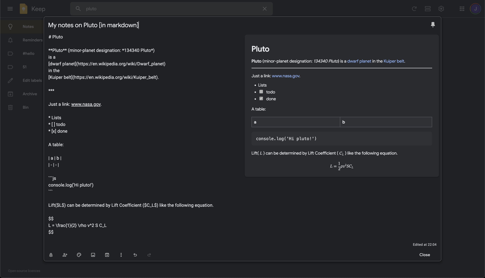
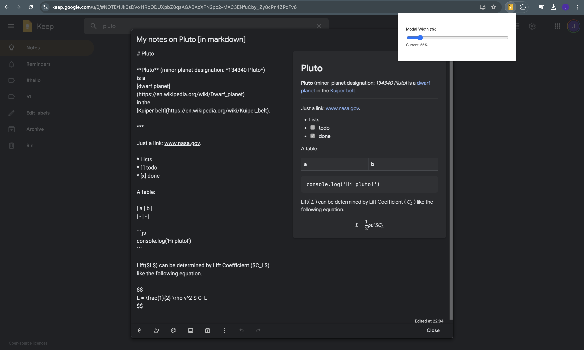

# KeepDown


A Chrome extension that adds real-time Markdown preview to Google Keep notes. Write your notes in Markdown and see them rendered instantly alongside your text.

## Features

- Real-time side-by-side Markdown preview
- Built on top of [micromark](https://github.com/micromark/micromark)
    - 100% CommonMark compliant
    - GitHub Flavored Markdown supported
    - LaTeX math expressions supported



## Modal Width Control

The extension adds a slider in the popup menu to control the width of the note modal. Click the extension icon to access the slider:
- Changes are saved and persist between sessions



## Chrome Extension Permissions

This extension uses minimal permissions:

### Content Script Host Access
- The extension only runs on `https://keep.google.com/*` to:
  1. Add the Markdown preview panel to the note editor
  2. Listen for changes in the note content to update the preview
  3. Apply custom styling for the preview panel
  
  The extension does not:
  - Collect or transmit any note content
  - Access any Google account information
  - Modify or store your notes
  - Make any network requests
  
  All processing is done locally in your browser.

### storage Permission
- Used to save your preferences (like the note modal width setting) between browser sessions. This ensures your customized settings persist after closing and reopening your browser.

## Getting Started

1. Clone this repository
2. Install dependencies:

```bash
npm install
```

3. Build the extension:

```bash
npm run dev
```

4. Load the extension into Chrome:
   - Open Chrome and navigate to chrome://extensions/
   - Enable "Developer mode" in the top right
   - Click "Load unpacked"
   - Select the `extension` directory
   - Click "Add"

## Building for Production

```bash
npm run build
```

Create distribution ZIP (for Chrome Web Store):

```bash
zip -r dist-zip/keepdown.zip extension
```
